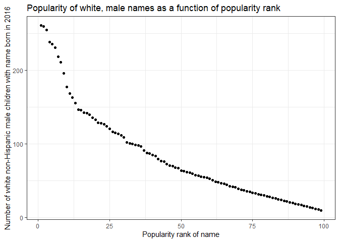

P8105 Homework 2
================
Jesse R. Ames
10/9/2021

``` r
library(tidyverse)
```

    ## -- Attaching packages --------------------------------------- tidyverse 1.3.1 --

    ## v ggplot2 3.3.5     v purrr   0.3.4
    ## v tibble  3.1.4     v dplyr   1.0.7
    ## v tidyr   1.1.3     v stringr 1.4.0
    ## v readr   2.0.1     v forcats 0.5.1

    ## -- Conflicts ------------------------------------------ tidyverse_conflicts() --
    ## x dplyr::filter() masks stats::filter()
    ## x dplyr::lag()    masks stats::lag()

``` r
library(readxl)
```

## Problem 1

This problem uses the Mr. Trash Wheel dataset, available as an Excel
file on the course website.

Read and clean the Mr. Trash Wheel sheet:

-   specify the sheet in the Excel file and to omit non-data entries
    (rows with notes / figures; columns containing notes) using
    arguments in read\_excel
-   use reasonable variable names
-   omit rows that do not include dumpster-specific data
-   round the number of sports balls to the nearest integer

``` r
mr_trash_wheel <- read_excel(
  path = "data/Trash-Wheel-Collection-Totals-7-2020-2.xlsx",
  sheet = "Mr. Trash Wheel",
  skip = 1, #Skip image
  range = cell_cols("A:N")) %>% #Omit extra columns
    janitor::clean_names() %>% #Make variable names nicer
    filter(!is.na(date)) %>% #Filter out monthly summary rows, grand total
    mutate(sports_balls = round(sports_balls)) #Round sports balls to the nearest integer

skimr::skim(mr_trash_wheel)
```

|                                                  |                  |
|:-------------------------------------------------|:-----------------|
| Name                                             | mr\_trash\_wheel |
| Number of rows                                   | 453              |
| Number of columns                                | 14               |
| \_\_\_\_\_\_\_\_\_\_\_\_\_\_\_\_\_\_\_\_\_\_\_   |                  |
| Column type frequency:                           |                  |
| character                                        | 2                |
| numeric                                          | 11               |
| POSIXct                                          | 1                |
| \_\_\_\_\_\_\_\_\_\_\_\_\_\_\_\_\_\_\_\_\_\_\_\_ |                  |
| Group variables                                  | None             |

Data summary

**Variable type: character**

| skim\_variable | n\_missing | complete\_rate | min | max | empty | n\_unique | whitespace |
|:---------------|-----------:|---------------:|----:|----:|------:|----------:|-----------:|
| dumpster       |          0 |              1 |   1 |   3 |     0 |       453 |          0 |
| month          |          0 |              1 |   3 |   9 |     0 |        13 |          0 |

**Variable type: numeric**

| skim\_variable       | n\_missing | complete\_rate |     mean |       sd |      p0 |     p25 |      p50 |      p75 |      p100 | hist  |
|:---------------------|-----------:|---------------:|---------:|---------:|--------:|--------:|---------:|---------:|----------:|:------|
| year                 |          0 |              1 |  2017.26 |     1.95 | 2014.00 | 2015.00 |  2018.00 |  2019.00 |   2021.00 | ▆▃▇▃▃ |
| weight\_tons         |          0 |              1 |     3.20 |     0.73 |    0.78 |    2.72 |     3.19 |     3.68 |      5.62 | ▁▃▇▃▁ |
| volume\_cubic\_yards |          0 |              1 |    15.41 |     1.48 |    7.00 |   15.00 |    15.00 |    15.00 |     20.00 | ▁▁▁▇▂ |
| plastic\_bottles     |          0 |              1 |  1898.93 |  1027.78 |  210.00 |  980.00 |  1850.00 |  2640.00 |   5960.00 | ▇▇▅▁▁ |
| polystyrene          |          0 |              1 |  1920.92 |  1161.89 |  210.00 |  950.00 |  1650.00 |  2730.00 |   6540.00 | ▇▅▃▁▁ |
| cigarette\_butts     |          0 |              1 | 24521.68 | 32047.72 |  980.00 | 5000.00 | 11000.00 | 32000.00 | 310000.00 | ▇▁▁▁▁ |
| glass\_bottles       |          0 |              1 |    22.45 |    17.44 |    0.00 |    9.00 |    18.00 |    32.00 |    110.00 | ▇▃▂▁▁ |
| grocery\_bags        |          0 |              1 |  1103.82 |   860.26 |   50.00 |  425.00 |   820.00 |  1620.00 |   3750.00 | ▇▅▂▂▁ |
| chip\_bags           |          0 |              1 |  1558.40 |   946.59 |  180.00 |  800.00 |  1327.00 |  2150.00 |   5085.00 | ▇▆▃▁▁ |
| sports\_balls        |          0 |              1 |    11.75 |     9.18 |    0.00 |    5.00 |     9.00 |    16.00 |     56.00 | ▇▃▁▁▁ |
| homes\_powered       |          0 |              1 |    45.32 |    21.71 |    0.00 |   38.83 |    51.17 |    58.67 |     93.67 | ▃▂▇▅▁ |

**Variable type: POSIXct**

| skim\_variable | n\_missing | complete\_rate | min        | max        | median     | n\_unique |
|:---------------|-----------:|---------------:|:-----------|:-----------|:-----------|----------:|
| date           |          0 |              1 | 1900-01-20 | 2021-01-04 | 2018-02-05 |       275 |

Read and clean precipitation data for 2018 and 2019. For each, omit rows
without precipitation data and add a variable for year. Next, combine
precipitation datasets and convert month to a character variable (the
variable `month.name` is built into R and should be useful).

``` r
precip_2018 <- read_excel(
  path = "data/Trash-Wheel-Collection-Totals-7-2020-2.xlsx",
  sheet = "2018 Precipitation",
  range = "A2:B14") %>%
    mutate(year = factor(2018))

precip_2019 <- read_excel(
  path = "data/Trash-Wheel-Collection-Totals-7-2020-2.xlsx",
  sheet = "2019 Precipitation",
  range = "A2:B14") %>%
    mutate(year = factor(2019))

#Combine, name months
precip_18_19 <- full_join(precip_2018, precip_2019) %>%
  janitor::clean_names() %>%
  mutate(month = month.name[month])
```

    ## Joining, by = c("Month", "Total", "year")

``` r
head(precip_18_19)
```

    ## # A tibble: 6 x 3
    ##   month    total year 
    ##   <chr>    <dbl> <fct>
    ## 1 January   0.94 2018 
    ## 2 February  4.8  2018 
    ## 3 March     2.69 2018 
    ## 4 April     4.69 2018 
    ## 5 May       9.27 2018 
    ## 6 June      4.77 2018

``` r
tail(precip_18_19)
```

    ## # A tibble: 6 x 3
    ##   month     total year 
    ##   <chr>     <dbl> <fct>
    ## 1 July       3.85 2019 
    ## 2 August     2.39 2019 
    ## 3 September  0.16 2019 
    ## 4 October    5.45 2019 
    ## 5 November   1.86 2019 
    ## 6 December   3.57 2019

Write a paragraph about these data; you are encouraged to use inline R.
Be sure to note the number of observations in both resulting datasets,
and give examples of key variables. For available data, what was the
total precipitation in 2018? What was the median number of sports balls
in a dumpster in 2019?

1.  The Mr. Trash Wheel dataset contains data from 453 dumpsters
    collected from May 2014 to January 2021, with details including the
    weight (in tons) and volume (in yards<sup>3</sup>) of trash
    collected, and counts of the plastic bottles, polystyrene
    containers, cigarette butts, and several other items. Additionally,
    the dataset includes the number of sports balls found in each
    dumpster, and the number of homes in Baltimore powered by
    incinerating the trash in each dumpster. In 2019, the median number
    of sports balls in a dumpster was 9.

2.  The precipitation dataset we created here contains the monthly total
    precipitation (presumably, in inches, in Baltimore) for each month
    in 2018 and 2019. The total precipitation in 2018 across all 12
    months was 70.33 inches, according to this data.

## Problem 2

This problem uses the [FiveThirtyEight
data](https://www.p8105.com/dataset_fivethirtyeight.html); these data
were gathered to create the interactive graphic on [this
page](https://fivethirtyeight.com/features/science-isnt-broken/#part1).
In particular, we’ll use the data in `pols-month.csv`,
`unemployment.csv`, and `snp.csv`. Our goal is to merge these into a
single data frame using year and month as keys across datasets.

First, clean the data in `pols-month.csv`. Use `separate()` to break up
the variable `mon` into integer variables year, month, and day; replace
month number with month name; create a president variable taking values
`gop` and `dem`, and remove `prez_dem` and `prez_gop`; and remove the
`day` variable.

``` r
pols_month <- read_csv(
  "data/fivethirtyeight_datasets/pols-month.csv") %>%
  separate(col = mon, into = c("year","month","day")) %>% #Separate dates into year/month/day
  mutate(month = month.name[as.integer(month)]) %>% #Name months
  mutate(prez_gop = as.factor(ifelse(prez_gop, yes = "gop", no = "dem"))) %>% #President variable
  mutate(prez = prez_gop, prez_gop = NULL, prez_dem = NULL, day = NULL) #Remove extra variables
```

    ## Rows: 822 Columns: 9

    ## -- Column specification --------------------------------------------------------
    ## Delimiter: ","
    ## dbl  (8): prez_gop, gov_gop, sen_gop, rep_gop, prez_dem, gov_dem, sen_dem, r...
    ## date (1): mon

    ## 
    ## i Use `spec()` to retrieve the full column specification for this data.
    ## i Specify the column types or set `show_col_types = FALSE` to quiet this message.

Second, clean the data in `snp.csv` using a similar process to the
above. For consistency across datasets, arrange according to year and
month, and organize so that year and month are the leading columns.

``` r
snp <- read_csv(
  "data/fivethirtyeight_datasets/snp.csv") %>%
    separate(col = date, into = c("month","day","year")) %>% #Separate dates into year/month/day
    mutate(month = month.name[as.integer(month)]) %>% #Name months
    mutate(day = NULL) %>% #Remove day
    mutate(year = case_when(
      as.numeric(year) < 50 ~ paste0("20", year),
      as.numeric(year) >= 50 ~ paste0("19", year)
    )) %>% #Four-digit year
    select(year, month, close) #Re-order columns
```

    ## Rows: 787 Columns: 2

    ## -- Column specification --------------------------------------------------------
    ## Delimiter: ","
    ## chr (1): date
    ## dbl (1): close

    ## 
    ## i Use `spec()` to retrieve the full column specification for this data.
    ## i Specify the column types or set `show_col_types = FALSE` to quiet this message.

Third, tidy the unemployment data so that it can be merged with the
previous datasets. This process will involve switching from “wide” to
“long” format; ensuring that key variables have the same name; and
ensuring that key variables take the same values.

``` r
unemployment <- read_csv(
  "data/fivethirtyeight_datasets/unemployment.csv")
```

    ## Rows: 68 Columns: 13

    ## -- Column specification --------------------------------------------------------
    ## Delimiter: ","
    ## dbl (13): Year, Jan, Feb, Mar, Apr, May, Jun, Jul, Aug, Sep, Oct, Nov, Dec

    ## 
    ## i Use `spec()` to retrieve the full column specification for this data.
    ## i Specify the column types or set `show_col_types = FALSE` to quiet this message.

``` r
names(unemployment) <- c("year", month.name) #I wasn't about to rename 12 variables manually
unemployment <- unemployment %>%
  pivot_longer(!year, names_to = "month", values_to = "unemployment_rate") %>% #Wide to long
  mutate(year = as.character(year))
```

Join the datasets by merging `snp` into `pols`, and merging
`unemployment` into the result.

``` r
pol_econ <- left_join(pols_month, snp) %>% left_join(unemployment)
```

    ## Joining, by = c("year", "month")
    ## Joining, by = c("year", "month")

``` r
skimr::skim(pol_econ)
```

|                                                  |           |
|:-------------------------------------------------|:----------|
| Name                                             | pol\_econ |
| Number of rows                                   | 822       |
| Number of columns                                | 11        |
| \_\_\_\_\_\_\_\_\_\_\_\_\_\_\_\_\_\_\_\_\_\_\_   |           |
| Column type frequency:                           |           |
| character                                        | 2         |
| factor                                           | 1         |
| numeric                                          | 8         |
| \_\_\_\_\_\_\_\_\_\_\_\_\_\_\_\_\_\_\_\_\_\_\_\_ |           |
| Group variables                                  | None      |

Data summary

**Variable type: character**

| skim\_variable | n\_missing | complete\_rate | min | max | empty | n\_unique | whitespace |
|:---------------|-----------:|---------------:|----:|----:|------:|----------:|-----------:|
| year           |          0 |              1 |   4 |   4 |     0 |        69 |          0 |
| month          |          0 |              1 |   3 |   9 |     0 |        12 |          0 |

**Variable type: factor**

| skim\_variable | n\_missing | complete\_rate | ordered | n\_unique | top\_counts        |
|:---------------|-----------:|---------------:|:--------|----------:|:-------------------|
| prez           |          0 |              1 | FALSE   |         2 | gop: 432, dem: 390 |

**Variable type: numeric**

| skim\_variable     | n\_missing | complete\_rate |   mean |     sd |     p0 |    p25 |    p50 |    p75 |    p100 | hist  |
|:-------------------|-----------:|---------------:|-------:|-------:|-------:|-------:|-------:|-------:|--------:|:------|
| gov\_gop           |          0 |           1.00 |  22.48 |   5.68 |  12.00 |  18.00 |  22.00 |  28.00 |   34.00 | ▆▆▇▅▅ |
| sen\_gop           |          0 |           1.00 |  46.10 |   6.38 |  32.00 |  42.00 |  46.00 |  51.00 |   56.00 | ▃▃▇▇▇ |
| rep\_gop           |          0 |           1.00 | 194.92 |  29.24 | 141.00 | 176.00 | 195.00 | 222.00 |  253.00 | ▃▇▆▃▅ |
| gov\_dem           |          0 |           1.00 |  27.20 |   5.94 |  17.00 |  22.00 |  28.00 |  32.00 |   41.00 | ▆▅▇▆▂ |
| sen\_dem           |          0 |           1.00 |  54.41 |   7.37 |  44.00 |  48.00 |  53.00 |  58.00 |   71.00 | ▇▆▇▃▂ |
| rep\_dem           |          0 |           1.00 | 244.97 |  31.37 | 188.00 | 211.00 | 250.00 | 268.00 |  301.00 | ▇▂▇▇▅ |
| close              |         36 |           0.96 | 472.85 | 543.29 |  17.05 |  83.67 | 137.26 | 932.06 | 2107.39 | ▇▁▂▁▁ |
| unemployment\_rate |         12 |           0.99 |   5.83 |   1.65 |   2.50 |   4.70 |   5.60 |   6.90 |   10.80 | ▃▇▅▂▁ |

Write a short paragraph about these datasets. Explain briefly what each
dataset contained, and describe the resulting dataset (e.g. give the
dimension, range of years, and names of key variables).

1.  The dataset `pols_month` contains data on the composition of the
    U.S. government every month from January 1947 to June 2015.
    Specifically, it contains the number of governors, senators, and
    house representatives from the Republican Party
    (`gov_gop`,`sen_gop`, and `rep_gop`) and the Democratic Party
    (`gov_dem`,`sen_dem`,`rep_dem`), and whether the president was a
    Republican or Democrat (`prez`).

2.  The dataset `snp` contains the monthly closing prices (`close`) of
    the Standard & Poors (S&P) 500 stock index from January 1950 to
    July 2015.

3.  The dataset `unemployment` contains the U.S. unemployment rate
    (`unemployment_rate`) for every month from January 1948 to
    June 2015.

4.  The combined dataset, `pol_econ`, has 11 columns and 822 rows
    spanning the years 1947 to 2015 which summarize the state of U.S.
    national politics and two (fairly inadequate) measures of the U.S.
    economy.

Note: we could have used a date variable as a key instead of creating
year and month keys; doing so would help with some kinds of plotting,
and be a more accurate representation of the data. Date formats are
tricky, though. For more information check out the `lubridate` package
in the `tidyverse`.

## Problem 3

This problem uses data from NYC Open data on the popularity of baby
names, and can be downloaded
[here](https://www.p8105.com/data/Popular_Baby_Names.csv).

Load and tidy the data. Note that, although these data may seem fairly
well formatted initially, the names of a categorical predictor and the
case structure of string variables changed over time; you’ll need to
address this in your data cleaning. Also, some rows seem duplicated, and
these will need to be removed (hint: google something like “dplyr remove
duplicate rows” to get started).

``` r
baby_names <- read_csv(
  "data/Popular_Baby_Names.csv")
```

    ## Rows: 19418 Columns: 6

    ## -- Column specification --------------------------------------------------------
    ## Delimiter: ","
    ## chr (3): Gender, Ethnicity, Child's First Name
    ## dbl (3): Year of Birth, Count, Rank

    ## 
    ## i Use `spec()` to retrieve the full column specification for this data.
    ## i Specify the column types or set `show_col_types = FALSE` to quiet this message.

``` r
#These data seem fine until you look closely
with(baby_names, unique(Ethnicity))
```

    ## [1] "ASIAN AND PACIFIC ISLANDER" "BLACK NON HISPANIC"        
    ## [3] "HISPANIC"                   "WHITE NON HISPANIC"        
    ## [5] "ASIAN AND PACI"             "BLACK NON HISP"            
    ## [7] "WHITE NON HISP"

``` r
tail(baby_names) #All caps bad
```

    ## # A tibble: 6 x 6
    ##   `Year of Birth` Gender Ethnicity          `Child's First Name` Count  Rank
    ##             <dbl> <chr>  <chr>              <chr>                <dbl> <dbl>
    ## 1            2011 MALE   WHITE NON HISPANIC BERISH                  10    97
    ## 2            2011 MALE   WHITE NON HISPANIC STEPHEN                 10    97
    ## 3            2011 MALE   WHITE NON HISPANIC STEPHEN                 10    97
    ## 4            2011 MALE   WHITE NON HISPANIC DEREK                   10    97
    ## 5            2011 MALE   WHITE NON HISPANIC BENNETT                 10    97
    ## 6            2011 MALE   WHITE NON HISPANIC ELLIS                   10    97

``` r
baby_names <- baby_names %>%
  janitor::clean_names() %>%
  mutate(childs_first_name = stringr::str_to_title(childs_first_name)) %>% #Adjust case
  mutate(ethnicity = substr(ethnicity, 1, regexpr("[^[:alpha:]]", ethnicity)-1)) %>%
  mutate(ethnicity = if_else(ethnicity == "", true = "HISPANIC", false = ethnicity)) %>%
  distinct() #Remove duplicate rows
```

Produce a well-structured, reader-friendly table showing the rank in
popularity of the name “Olivia” as a female baby name over time; this
should have rows for ethnicities and columns for year. Produce a similar
table showing the most popular name among male children over time.

``` r
olivia <- baby_names %>%
  filter(childs_first_name == "Olivia") %>%
  mutate(count = NULL, gender = NULL, childs_first_name = NULL) %>%
  arrange(year_of_birth) %>%
  pivot_wider(names_from = year_of_birth, values_from = rank)
knitr::kable(olivia, caption = "Popularity rank of 'Olivia' as a female baby name in NYC by ethnicity from 2011 to 2016")
```

| ethnicity | 2011 | 2012 | 2013 | 2014 | 2015 | 2016 |
|:----------|-----:|-----:|-----:|-----:|-----:|-----:|
| ASIAN     |    4 |    3 |    3 |    1 |    1 |    1 |
| BLACK     |   10 |    8 |    6 |    8 |    4 |    8 |
| HISPANIC  |   18 |   22 |   22 |   16 |   16 |   13 |
| WHITE     |    2 |    4 |    1 |    1 |    1 |    1 |

Popularity rank of ‘Olivia’ as a female baby name in NYC by ethnicity
from 2011 to 2016

``` r
pop_boy <- baby_names %>%
  filter(gender == "MALE" & rank == 1) %>%
  mutate(gender = NULL, count = NULL, rank = NULL) %>%
  arrange(year_of_birth) %>%
  pivot_wider(names_from = year_of_birth, values_from = childs_first_name)
knitr::kable(pop_boy, caption = "Most popular male baby name in NYC by ethnicity from 2011 to 2016")
```

| ethnicity | 2011    | 2012   | 2013   | 2014   | 2015   | 2016   |
|:----------|:--------|:-------|:-------|:-------|:-------|:-------|
| ASIAN     | Ethan   | Ryan   | Jayden | Jayden | Jayden | Ethan  |
| BLACK     | Jayden  | Jayden | Ethan  | Ethan  | Noah   | Noah   |
| HISPANIC  | Jayden  | Jayden | Jayden | Liam   | Liam   | Liam   |
| WHITE     | Michael | Joseph | David  | Joseph | David  | Joseph |

Most popular male baby name in NYC by ethnicity from 2011 to 2016

Finally, for male, white non-hispanic children born in 2016, produce a
scatter plot showing the number of children with a name (y axis) against
the rank in popularity of that name (x axis).

``` r
#I expect this will be a power law distribution
baby_names %>%
  filter(ethnicity == "WHITE", year_of_birth == 2016, gender == "MALE") %>%
  ggplot(aes(x = rank, y = count)) +
  theme_bw() +
  geom_point() +
  labs(title = "Popularity of white, male names as a function of popularity rank",
       x = "Popularity rank of name",
       y = "Number of white non-Hispanic male children with name born in 2016")
```

<!-- -->
